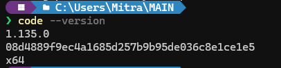
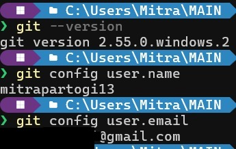
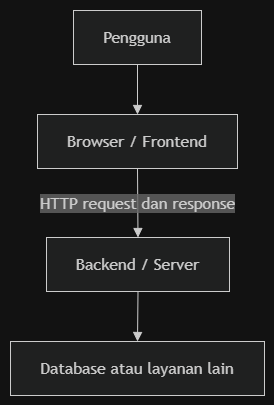
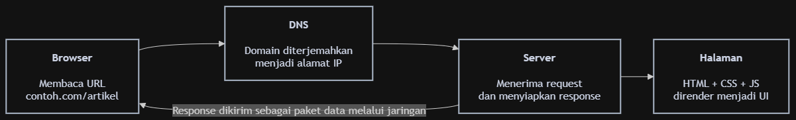
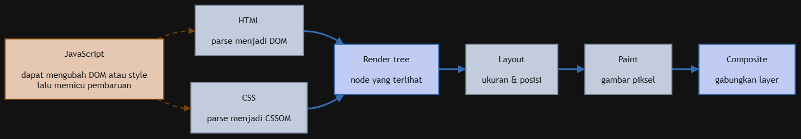
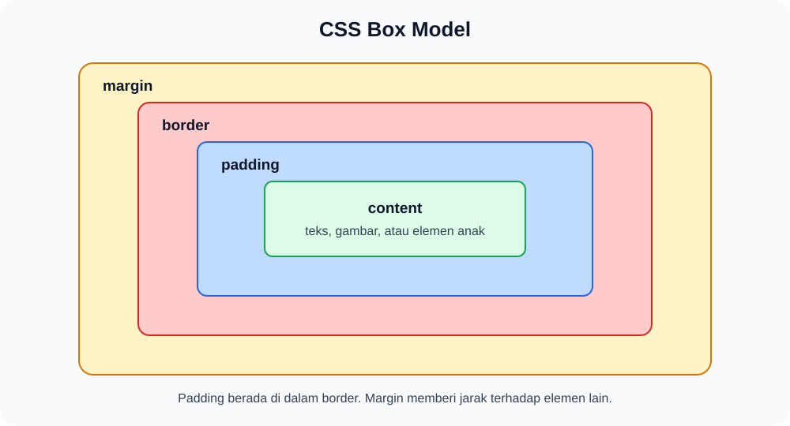

# Materi 2 - Frontend Development

Materi ini membahas dasar pengembangan frontend menggunakan HTML, Tailwind CSS, React, dan Next.js. Peserta akan mempelajari cara halaman web dimuat oleh browser, membuat layout responsif, mengambil data dari API, dan menyimpan data favorit di browser.

Di akhir materi, peserta akan membuat halaman daftar post yang mengambil data dari API publik dan menyimpan post favorit menggunakan `localStorage`.

## 1. Rencana Pembelajaran

| Sesi | Topik                                |
| ---- | ------------------------------------ |
| 1    | Fondasi website, HTML, dan layouting |
| 2    | JavaScript, React, dan Next.js       |
| 3    | REST API, form, dan data fetching    |
| 4    | Browser storage, SEO, dan praktik    |

### 1.1 Persiapan dan Instalasi Dependencies

Sebelum sesi pembelajaran dan praktik dimulai, pastikan seluruh _tools_ dan _dependencies_ berikut telah terinstal dan terkonfigurasi dengan baik di perangkat Anda.

#### 1. Visual Studio Code (Code Editor)

Visual Studio Code (VS Code) adalah editor teks utama yang digunakan untuk menulis dan mengelola kode.

- **Langkah Instalasi:**
  1. Kunjungi laman resmi [code.visualstudio.com](https://code.visualstudio.com/).
  2. Unduh _installer_ sesuai dengan sistem operasi Anda (Windows, macOS, atau Linux).
  3. Jalankan file _installer_ dan ikuti petunjuk pemasangan hingga selesai (pada Windows, centang opsi _Add "Open with Code" to context menu_).
- **Rekomendasi Extension:**
  - **Tailwind CSS IntelliSense**: Membantu _auto-complete_ class Tailwind.
  - **ESLint**: Membantu mendeteksi kesalahan sintaksis kode.
  - **Prettier - Code formatter**: Merapikan format kode secara otomatis.
- **Cek Instalasi:**
  Buka terminal (Command Prompt / PowerShell / Terminal) lalu jalankan:

  ```bash
  code --version
  ```

  Jika nomor versi tampil, VS Code siap digunakan.
  Contoh :

  

#### 2. Git CLI dan Konfigurasi Akun GitHub

Git digunakan untuk sistem pengontrol versi (_version control_). Panduan ini mengasumsikan Anda sudah memiliki akun [GitHub](https://github.com/).

- **Langkah Instalasi:**
  1. Kunjungi laman resmi [klik disini](https://github.com/git-for-windows/git/releases/download/v2.55.0.windows.5/Git-2.55.0.5-64-bit.exe).
  2. Unduh _installer_ sesuai sistem operasi Anda, lalu jalankan instalasi menggunakan pengaturan _default_.
- **Cek Instalasi Git:**
  ```bash
  git --version
  ```
- **Konfigurasi Identitas Git:**
  Hubungkan identitas lokal Git dengan nama dan email akun GitHub pribadi Anda melalui perintah:
  ```bash
  git config --global user.name "[username github kamu]"
  git config --global user.email "[email github kamu]"
  ```
- **Cek Konfigurasi Git:**
  Pastikan identitas berhasil tersimpan dengan menjalankan:
  ```bash
  git config --list
  ```
  Periksa baris `user.name` dan `user.email` pada output yang ditampilkan.

  Contoh:

  

  

#### 3. Node.js (JavaScript Runtime)

Node.js dibutuhkan untuk menjalankan JavaScript di lingkungan lokal dan mengeksekusi _server development_ Next.js.

- **Langkah Instalasi:**
  1. Kunjungi laman resmi [nodejs.org](https://nodejs.org/).
  2. Unduh versi **LTS (Long Term Support)** yang stabil.
  3. Jalankan _installer_ dan ikuti proses pemasangan hingga selesai.
  4. _Restart_ (tutup lalu buka kembali) terminal Anda agar _path_ Node.js terbaca oleh sistem.
- **Cek Instalasi Node.js dan npm:**
  ```bash
  node -v
  npm -v
  ```
  Pastikan versi Node.js yang muncul minimal v18.x atau lebih baru (disarankan v20.x ke atas).

#### 4. pnpm (Fast Package Manager)

pnpm adalah _package manager_ yang efisien, hemat ruang penyimpanan disk, dan cepat dalam mengunduh modul dependensi.

- **Langkah Instalasi:**
  Jalankan perintah berikut di terminal menggunakan `npm` bawaan Node.js:
  ```bash
  npm install -g pnpm
  ```
- **Cek Instalasi pnpm:**
  ```bash
  pnpm -v
  ```
  Jika nomor versi muncul, pnpm siap digunakan untuk mengelola dependensi proyek.

---

### 1.2 Inisialisasi Proyek Next.js

Buat proyek Next.js sebelum kelas dimulai agar waktu sesi praktik dapat difokuskan langsung untuk membedah kode dan memahami konsep.

1. Buka terminal di direktori kerja yang Anda inginkan, lalu jalankan perintah:

   ```bash
   pnpm create next-app frontend-lbe-alpro
   ```

2. Pada pertanyaan konfigurasi interaktif yang muncul di terminal, pilih opsi berikut:
   - **Would you like to use TypeScript?** → `Yes`
   - **Would you like to use ESLint?** → `Yes`
   - **Would you like to use Tailwind CSS?** → `Yes`
   - **Would you like your code inside a `src/` directory?** → `No`
   - **Would you like to use App Router? (recommended)** → `Yes`
   - **Would you like to use Turbopack for `next dev`?** → `Yes` / `No` (default)
   - **Would you like to customize the import alias (`@/*` by default)?** → `No`

3. Masuk ke dalam direktori proyek dan jalankan _development server_:

   ```bash
   cd frontend-lbe-alpro
   pnpm dev
   ```

4. **Verifikasi Akhir:**
   Buka browser dan kunjungi [http://localhost:3000](http://localhost:3000). Jika halaman pembuka Next.js berhasil tampil, seluruh dependensi dan lingkungan pengembangan Anda sudah siap digunakan.

## 2. Dasar Website dan Browser

### 2.1 Internet, website, dan frontend

Internet adalah jaringan dari banyak jaringan komputer yang saling terhubung. Website adalah layanan di atas internet yang dibuka melalui browser menggunakan URL.


Frontend adalah bagian aplikasi yang dilihat dan digunakan langsung oleh pengguna. Frontend menampilkan data, menerima interaksi pengguna, lalu mengirim request ke backend bila aplikasi membutuhkan data atau proses dari server.



Istilah penting:

- **Domain** adalah nama yang mudah dibaca manusia untuk sebuah server, misalnya `example.com`.
- **Hosting** adalah layanan dan sumber daya server yang membuat website atau aplikasi dapat diakses dari internet.
- **URL (Uniform Resource Locator)** adalah alamat lengkap menuju resource tertentu, misalnya `https://senopati.its.ac.id/`.
- **DNS** menerjemahkan domain menjadi alamat IP agar browser dapat menemukan server.
- **Konten** adalah informasi yang ditampilkan kepada pengguna, seperti teks, gambar, video, dan data produk.

Contoh bagian URL:

```text
https://blog.example.com/posts/42?mode=ringkas#komentar
└─┬─┘   └──────┬───────┘└───┬───┘ └────┬────┘ └───┬────┘
skema     host/domain     path       query     fragment
```

Domain hanya merupakan bagian dari URL. URL dapat menunjuk ke halaman, gambar, file, atau endpoint API tertentu pada sebuah domain.

### 2.2 Cara browser memuat halaman

Ketika pengguna membuka sebuah URL, browser melakukan proses berikut:

1. Browser membaca URL yang dimasukkan pengguna.
2. DNS menerjemahkan nama domain menjadi alamat IP.
3. Browser membuat koneksi ke server. Pada HTTPS, koneksi diamankan menggunakan TLS.
4. Browser mengirim HTTP request, misalnya `GET /posts/42`.
5. Server mengirim HTTP response yang berisi status, header, dan data.
6. Browser memproses HTML, CSS, JavaScript, gambar, font, dan aset lain.

Ilustrasi low cortisolnya bisa Anda lihat [disini](https://howdns.works/ep1/)



Browser memiliki rendering engine yang mengubah dokumen dan style menjadi tampilan di layar.



Proses rendering yang disederhanakan:

- HTML diparsing menjadi **DOM**, yaitu struktur pohon dari isi halaman.
- CSS diparsing menjadi **CSSOM**, yaitu struktur aturan style.
- DOM dan CSSOM membentuk **render tree**.
- Browser menghitung ukuran dan posisi elemen pada tahap **layout**.
- Browser menggambar elemen pada tahap **paint**, lalu menggabungkan layer pada tahap **compositing**.

JavaScript dapat mengubah DOM atau style. Perubahan tersebut dapat membuat browser menghitung ulang sebagian tampilan halaman. Framework seperti React dan Next.js membantu pengembang membuat aplikasi, tetapi browser pada akhirnya tetap memproses HTML, CSS, JavaScript, dan aset web lainnya.

### 2.3 Struktur HTML dan aksesibilitas

HTML menentukan struktur dan makna konten. Gunakan elemen berdasarkan fungsi kontennya, bukan hanya karena hasil visualnya sesuai.

```html
<!doctype html>
<html lang="id">
  <head>
    <meta charset="UTF-8" />
    <meta name="viewport" content="width=device-width, initial-scale=1" />
    <title>Daftar Artikel</title>
  </head>
  <body>
    <header>
      <nav aria-label="Navigasi utama">
        <a href="/">Beranda</a>
        <a href="/artikel">Artikel</a>
      </nav>
    </header>
    <main>
      <h1>Artikel terbaru</h1>
      <article>
        <h2>Belajar Semantic HTML</h2>
        <p>Struktur yang baik membantu manusia dan mesin memahami halaman.</p>
        <button type="button">Simpan artikel</button>
      </article>
    </main>
  </body>
</html>
```

| Elemen    | Kegunaan                                                    |
| --------- | ----------------------------------------------------------- |
| `header`  | Bagian pembuka halaman atau section                         |
| `nav`     | Kumpulan navigasi                                           |
| `main`    | Konten utama halaman                                        |
| `section` | Kelompok konten dengan tema yang sama                       |
| `article` | Konten yang dapat berdiri sendiri, seperti post atau berita |
| `footer`  | Bagian penutup halaman atau section                         |

Gunakan aturan aksesibilitas dasar berikut:

- Gunakan satu `h1` untuk tujuan utama halaman, lalu jaga urutan heading.
- Hubungkan setiap input dengan `label`.
- Isi atribut `alt` sesuai fungsi gambar. Gunakan `alt=""` untuk gambar dekoratif.
- Gunakan `button` untuk aksi dan `a` untuk navigasi.
- Pastikan tombol, input, dan link dapat digunakan dengan keyboard.
- Jangan hanya menggunakan warna untuk menyampaikan error atau status.

Elemen block seperti `div`, `p`, dan `section` biasanya memulai baris baru. Elemen inline seperti `span`, `strong`, dan `a` biasanya mengalir bersama teks. Sifat tersebut berasal dari nilai `display` bawaan CSS dan dapat diubah.

## 3. Styling dengan Tailwind CSS

### 3.1 Box model

Setiap elemen visual dapat dipahami sebagai sebuah kotak. Kotak tersebut terdiri dari content, padding, border, dan margin.



| Bagian  | Kegunaan                                           |
| ------- | -------------------------------------------------- |
| Content | Isi elemen, seperti teks, gambar, atau elemen anak |
| Padding | Ruang di dalam border, antara content dan border   |
| Border  | Garis batas elemen                                 |
| Margin  | Ruang di luar border terhadap elemen lain          |

Padding memberi ruang di dalam elemen. Margin memberi jarak antara satu elemen dan elemen lain.

### 3.2 Utility class Tailwind

Tailwind CSS menyediakan utility class yang dapat dirangkai langsung pada elemen.

```tsx
<article className="rounded-xl border border-slate-200 bg-white p-4 shadow-sm">
  <h2 className="text-lg font-semibold text-slate-900">Judul artikel</h2>
  <p className="mt-2 text-sm text-slate-600">Ringkasan artikel.</p>
</article>
```

Pada skala spacing bawaan Tailwind, `1` bernilai `0.25rem`. Dengan ukuran font root browser 16 piksel, nilai ini setara dengan 4 piksel. Contoh `p-4` memberi padding `1rem`, yang biasanya setara dengan 16 piksel.

### 3.3 Flexbox, Grid, dan responsive design

Gunakan Flexbox ketika elemen tersusun dalam satu arah utama. Gunakan Grid ketika layout membutuhkan kontrol baris dan kolom.

| Kebutuhan                     | Pilihan | Contoh                       |
| ----------------------------- | ------- | ---------------------------- |
| Navigasi dalam satu baris     | Flexbox | Logo, link, dan tombol masuk |
| Meratakan ikon dan teks       | Flexbox | Isi tombol atau badge        |
| Daftar card                   | Grid    | Daftar post atau produk      |
| Layout halaman beberapa kolom | Grid    | Sidebar dan konten utama     |

```tsx
{
  /* Flexbox untuk navigasi */
}
<nav className="flex items-center justify-between gap-4">...</nav>;

{
  /* Grid untuk daftar card */
}
<section className="grid grid-cols-1 gap-4 md:grid-cols-2 lg:grid-cols-3">
  ...
</section>;
```

Tailwind menggunakan pendekatan mobile-first. Class tanpa prefix berlaku untuk layar kecil. Class dengan prefix breakpoint berlaku mulai ukuran tersebut dan ke atas.

```tsx
<h1 className="text-2xl md:text-4xl">Daftar Artikel</h1>
```

| Prefix | Lebar minimum |
| ------ | ------------: |
| `sm`   |        640 px |
| `md`   |        768 px |
| `lg`   |       1024 px |
| `xl`   |       1280 px |
| `2xl`  |       1536 px |

Mulailah dari layout yang nyaman di layar kecil. Tambahkan perubahan untuk layar lebih besar hanya jika diperlukan.

## 4. JavaScript, React, dan Next.js

### 4.1 JavaScript dan TypeScript

JavaScript membuat halaman menjadi interaktif. JavaScript dapat merespons klik dan input, mengubah tampilan, mengambil data dari API, serta memakai browser API seperti `localStorage`.

```ts
const posts = [
  { id: 1, title: "HTML Dasar", published: true },
  { id: 2, title: "CSS Layout", published: false },
];

const publishedTitles = posts
  .filter((post) => post.published)
  .map((post) => post.title);
```

TypeScript adalah JavaScript dengan sistem tipe statis. TypeScript membantu editor dan compiler menemukan ketidaksesuaian bentuk data sebelum kode dijalankan.

```ts
type Post = {
  id: number;
  title: string;
  body: string;
};

function getPostTitle(post: Post): string {
  return post.title;
}
```

TypeScript tidak memvalidasi data ketika aplikasi berjalan. Jika server mengirim data dengan bentuk yang berbeda, aplikasi tetap perlu melakukan validasi sesuai kebutuhan.

### 4.2 React dan Next.js

React adalah library untuk menyusun antarmuka dari komponen. Next.js adalah framework React yang menyediakan routing berbasis file, strategi rendering, optimasi aset, dan fitur produksi lainnya.

Next.js dapat memakai static rendering, server rendering, atau client rendering. Tidak semua halaman Next.js selalu dirender menggunakan SSR. Pilih strategi sesuai kebutuhan data dan interaksi halaman.

```text
frontend/
├── app/
│   ├── layout.tsx          # UI bersama dan metadata global
│   ├── page.tsx            # route /
│   ├── posts/
│   │   ├── page.tsx        # route /posts
│   │   └── [id]/
│   │       └── page.tsx    # route dinamis /posts/:id
│   └── _components/        # folder privat, bukan route
├── components/             # komponen reusable berdasarkan konvensi tim
├── public/                 # aset statis
└── package.json
```

Hal penting pada App Router:

- Folder di dalam `app` membentuk segmen URL.
- Sebuah route dapat diakses ketika segmennya memiliki `page.tsx` atau `route.ts`.
- Folder `[id]` adalah dynamic segment untuk URL seperti `/posts/1`.
- Folder yang diawali underscore, seperti `_components`, adalah private folder dan tidak menjadi route.
- Komponen pada App Router secara default adalah Server Component.
- Tambahkan `'use client'` ketika komponen memerlukan state, effect, event handler, atau browser API.

### 4.3 State, effect, dan prop drilling

`useState` menyimpan data yang dapat berubah. Ketika state diperbarui, React merender ulang komponen yang relevan.

```tsx
"use client";

import { useState } from "react";

export default function Counter() {
  const [count, setCount] = useState(0);

  return (
    <button type="button" onClick={() => setCount((current) => current + 1)}>
      Diklik {count} kali
    </button>
  );
}
```

`useEffect` digunakan untuk menyinkronkan komponen dengan sistem di luar React, misalnya browser API, event listener, timer, atau library eksternal.

```tsx
useEffect(() => {
  document.title = `Diklik ${count} kali`;
}, [count]);
```

Jangan menggunakan effect untuk perhitungan yang dapat dilakukan langsung saat render, misalnya `const total = price * quantity`.

Data React biasanya mengalir dari komponen induk ke anak melalui props. Prop drilling terjadi ketika props hanya diteruskan melewati beberapa komponen agar sampai ke komponen yang membutuhkannya.

```text
App (user)
└── Layout (meneruskan user)
    └── Header (meneruskan user)
        └── Avatar (memakai user)
```

Prop drilling tidak selalu salah. Jika rantai props mulai sulit dirawat, pertimbangkan component composition, Context, atau state manager sesuai skala aplikasi.

## 5. REST API dan Pengelolaan Data

### 5.1 Client, server, dan HTTP

Frontend bertindak sebagai client. Client mengirim request ke endpoint API. Server memproses request dan mengirim response.

```text
Client                         Server
  |                              |
  | GET /posts/1 HTTP/1.1        |
  |----------------------------->|
  |                              | mencari data
  | HTTP/1.1 200 OK              |
  | { "id": 1, "title": "..." } |
  |<-----------------------------|
```

| Method   | Kegunaan                          | Contoh                |
| -------- | --------------------------------- | --------------------- |
| `GET`    | Mengambil data                    | Mengambil daftar post |
| `POST`   | Membuat data baru                 | Menambahkan post      |
| `PUT`    | Mengganti data secara keseluruhan | Mengganti post        |
| `PATCH`  | Mengubah sebagian data            | Mengubah judul post   |
| `DELETE` | Menghapus data                    | Menghapus post        |

API umumnya mengirim data dalam format JSON.

```json
{
  "id": 1,
  "title": "Belajar API",
  "published": true,
  "tags": ["frontend", "http"]
}
```

Gunakan `application/json` untuk data terstruktur tanpa file. Gunakan `multipart/form-data` ketika request mengirim file bersama field lain. Jika memakai `FormData` di browser, jangan mengatur header `Content-Type` secara manual karena browser perlu menambahkan boundary.

| Kelompok status | Arti                                     | Contoh                                                 |
| --------------- | ---------------------------------------- | ------------------------------------------------------ |
| `2xx`           | Request berhasil                         | `200 OK`, `201 Created`                                |
| `4xx`           | Request atau otorisasi client bermasalah | `400 Bad Request`, `401 Unauthorized`, `404 Not Found` |
| `5xx`           | Server gagal memproses request           | `500 Internal Server Error`, `503 Service Unavailable` |

### 5.2 Form native dan React Hook Form

Form HTML native cocok untuk kebutuhan sederhana. Nilai form dapat dibaca menggunakan `FormData`, sehingga tidak selalu memerlukan satu `useState` untuk setiap input.

```tsx
import type { FormEvent } from "react";

function handleSubmit(event: FormEvent<HTMLFormElement>) {
  event.preventDefault();
  const formData = new FormData(event.currentTarget);
  const title = String(formData.get("title") ?? "");
  console.log({ title });
}
```

React Hook Form membantu ketika form memiliki banyak field, validasi, error, atau status submit yang perlu dikelola.

```bash
pnpm add react-hook-form
```

```tsx
"use client";

import { useForm } from "react-hook-form";

type PostForm = { title: string };

export function CreatePostForm() {
  const {
    register,
    handleSubmit,
    formState: { errors },
  } = useForm<PostForm>();

  return (
    <form onSubmit={handleSubmit((data) => console.log(data))}>
      <label htmlFor="title">Judul</label>
      <input
        id="title"
        {...register("title", { required: "Judul wajib diisi" })}
      />
      {errors.title && <p role="alert">{errors.title.message}</p>}
      <button type="submit">Simpan</button>
    </form>
  );
}
```

### 5.3 Data fetching dan caching

Fetch API sudah tersedia di browser. Response JSON perlu diparsing menggunakan `.json()` dan status HTTP perlu diperiksa secara manual.

```ts
async function getPosts() {
  const response = await fetch("https://jsonplaceholder.typicode.com/posts");

  if (!response.ok) {
    throw new Error(`Gagal mengambil data: ${response.status}`);
  }

  return response.json();
}
```

`fetch` dapat selesai normal walaupun server mengirim status `404` atau `500`. Karena itu, periksa `response.ok` sebelum membaca data.

Axios adalah library HTTP yang menyediakan `response.data`, instance terpusat, dan interceptor.

```bash
pnpm add axios
```

TanStack Query membantu mengelola server state di client. Library ini menyediakan cache, status pending dan error, retry, invalidasi, deduplikasi request, dan refetch yang dapat dikonfigurasi.

```tsx
const postsQuery = useQuery({
  queryKey: ["posts"],
  queryFn: getPosts,
});

if (postsQuery.isPending) return <p>Memuat...</p>;
if (postsQuery.isError) return <p>Data gagal dimuat.</p>;

return <PostList posts={postsQuery.data} />;
```

TanStack Query dapat memakai Fetch API atau Axios di dalam `queryFn`. TanStack Query bukan pengganti HTTP client, melainkan lapisan untuk mengelola data yang sumber kebenarannya berada di server.

## 6. Browser Storage dan SEO

### 6.1 Browser storage

| Penyimpanan      | Masa hidup                          | Kegunaan umum                              |
| ---------------- | ----------------------------------- | ------------------------------------------ |
| `localStorage`   | Bertahan sampai dihapus             | Tema, ID favorit                           |
| `sessionStorage` | Selama tab atau sesi halaman dibuka | Draft sementara dalam satu tab             |
| Cookie           | Sesuai masa berlaku yang diatur     | Session berbasis cookie, preferensi server |

`localStorage` dan `sessionStorage` hanya menyimpan string. Object dan array perlu diubah menggunakan `JSON.stringify`, lalu dibaca kembali menggunakan `JSON.parse`.

```ts
const favoriteIds = [1, 4, 8];
localStorage.setItem("favoritePostIds", JSON.stringify(favoriteIds));

const saved = localStorage.getItem("favoritePostIds");
const parsedIds: number[] = saved ? JSON.parse(saved) : [];
```

Browser API seperti `localStorage` hanya tersedia di client. Pada Next.js, akseslah di dalam `useEffect` atau setelah pengguna melakukan event seperti klik tombol.

Jangan menyimpan password, data rahasia, atau token sensitif di Web Storage. JavaScript yang berjalan pada origin yang sama dapat membacanya. Untuk session autentikasi, cookie `HttpOnly`, `Secure`, dan `SameSite` yang diatur server sering menjadi pilihan yang lebih aman, tergantung arsitektur aplikasi.

### 6.2 Metadata dan gambar Next.js

Metadata membantu mesin pencari dan platform berbagi memahami halaman. Metadata dapat didefinisikan pada `app/layout.tsx` atau `app/page.tsx` yang merupakan Server Component.

```tsx
import type { Metadata } from "next";

export const metadata: Metadata = {
  title: "Daftar Post",
  description: "Kumpulan post untuk latihan fundamental frontend.",
};
```

Komponen `Image` Next.js membantu menyediakan ukuran gambar, lazy loading, dan optimasi gambar. Hal ini dapat membantu mencegah layout shift dan mengoptimalkan gambar yang menjadi kandidat Largest Contentful Paint (LCP).

```tsx
import Image from "next/image";
import heroImage from "@/public/hero.jpg";

<Image
  src={heroImage}
  alt="Peserta sedang mengikuti kelas frontend"
  sizes="(max-width: 768px) 100vw, 50vw"
/>;
```

`Image` tidak menjamin skor LCP otomatis. Ukuran file, waktu response server, font, JavaScript, dan prioritas gambar utama tetap memengaruhi performa.

## 7. Praktik: Post Explorer

Praktik ini menggunakan [JSONPlaceholder](https://jsonplaceholder.typicode.com/) sebagai API publik. API tersebut menyediakan data dummy sehingga peserta dapat fokus pada proses request, render data, dan browser storage.

Target praktik:

- Mengambil 12 post dari API publik.
- Menampilkan loading state dan error state.
- Menampilkan post dalam Grid responsif.
- Menyimpan ID post favorit ke `localStorage`.
- Mempertahankan status favorit setelah halaman dimuat ulang.

### 7.1 Mengganti halaman utama

Pastikan terminal berada di folder `frontend/` dan development server sudah berjalan.

```bash
pnpm dev
```

Ganti isi `app/page.tsx` dengan kode berikut:

```tsx
"use client";

import { useEffect, useState } from "react";

type Post = {
  userId: number;
  id: number;
  title: string;
  body: string;
};

const API_URL = "https://jsonplaceholder.typicode.com/posts?_limit=12";
const STORAGE_KEY = "favoritePostIds";

export default function Home() {
  const [posts, setPosts] = useState<Post[]>([]);
  const [favoriteIds, setFavoriteIds] = useState<number[]>([]);
  const [isLoading, setIsLoading] = useState(true);
  const [error, setError] = useState("");

  useEffect(() => {
    try {
      const savedIds = localStorage.getItem(STORAGE_KEY);
      setFavoriteIds(savedIds ? JSON.parse(savedIds) : []);
    } catch {
      localStorage.removeItem(STORAGE_KEY);
    }
  }, []);

  useEffect(() => {
    const controller = new AbortController();

    async function loadPosts() {
      try {
        const response = await fetch(API_URL, { signal: controller.signal });

        if (!response.ok) {
          throw new Error(`HTTP ${response.status}`);
        }

        const data: Post[] = await response.json();
        setPosts(data);
      } catch (caughtError) {
        if (caughtError instanceof Error && caughtError.name !== "AbortError") {
          setError("Post gagal dimuat. Periksa koneksi lalu coba lagi.");
        }
      } finally {
        setIsLoading(false);
      }
    }

    loadPosts();
    return () => controller.abort();
  }, []);

  function toggleFavorite(postId: number) {
    setFavoriteIds((currentIds) => {
      const nextIds = currentIds.includes(postId)
        ? currentIds.filter((id) => id !== postId)
        : [...currentIds, postId];

      localStorage.setItem(STORAGE_KEY, JSON.stringify(nextIds));
      return nextIds;
    });
  }

  return (
    <main className="min-h-screen bg-slate-50 px-4 py-10 text-slate-900">
      <div className="mx-auto max-w-6xl">
        <header className="mb-8">
          <p className="text-sm font-semibold uppercase tracking-wider text-blue-700">
            Latihan Frontend
          </p>
          <h1 className="mt-2 text-3xl font-bold md:text-5xl">Post Explorer</h1>
          <p className="mt-3 max-w-2xl text-slate-600">
            Data berasal dari JSONPlaceholder. Tandai post untuk menyimpannya di
            browser ini.
          </p>
        </header>

        {isLoading && <p role="status">Memuat post...</p>}
        {error && (
          <p role="alert" className="rounded-lg bg-red-50 p-4 text-red-700">
            {error}
          </p>
        )}

        {!isLoading && !error && (
          <section
            aria-label="Daftar post"
            className="grid grid-cols-1 gap-4 md:grid-cols-2 lg:grid-cols-3">
            {posts.map((post) => {
              const isFavorite = favoriteIds.includes(post.id);

              return (
                <article
                  key={post.id}
                  className="flex flex-col rounded-2xl border border-slate-200 bg-white p-5 shadow-sm">
                  <p className="text-sm font-medium text-blue-700">
                    Post #{post.id}
                  </p>
                  <h2 className="mt-2 text-xl font-semibold capitalize">
                    {post.title}
                  </h2>
                  <p className="mt-3 flex-1 text-sm leading-6 text-slate-600">
                    {post.body}
                  </p>
                  <button
                    type="button"
                    aria-pressed={isFavorite}
                    onClick={() => toggleFavorite(post.id)}
                    className={`mt-5 rounded-lg px-4 py-2 text-sm font-semibold transition ${
                      isFavorite
                        ? "bg-amber-100 text-amber-900 hover:bg-amber-200"
                        : "bg-slate-900 text-white hover:bg-slate-700"
                    }`}>
                    {isFavorite ? "Hapus dari favorit" : "Simpan favorit"}
                  </button>
                </article>
              );
            })}
          </section>
        )}
      </div>
    </main>
  );
}
```

### 7.2 Alur praktik

|        Menit | Aktivitas                          | Konsep                                        |
| -----------: | ---------------------------------- | --------------------------------------------- |
|   0 sampai 4 | Menjalankan fetch dan melihat data | Endpoint, `response.ok`, JSON, loading, error |
|   4 sampai 9 | Render data menjadi card           | `.map()`, `key`, semantic HTML, Grid          |
|  9 sampai 13 | Menambahkan favorit                | `useState`, update array, `aria-pressed`      |
| 13 sampai 15 | Refresh dan inspeksi storage       | `JSON.stringify`, `JSON.parse`, DevTools      |

### 7.3 Verifikasi hasil

1. Ubah lebar browser. Grid harus berubah dari satu, dua, lalu tiga kolom.
2. Klik **Simpan favorit** pada beberapa post.
3. Buka DevTools, lalu pilih **Application > Local Storage**.
4. Pastikan key `favoritePostIds` berisi array ID.
5. Refresh halaman. Status favorit harus tetap muncul.

Jika status favorit hilang setelah refresh, periksa penggunaan `localStorage.setItem`, `JSON.stringify`, dan pemanggilan `localStorage.getItem` di dalam `useEffect`.

## 8. Checklist

### Harus dipahami pada materi ini

- [ ] Seluruh _tools_ dan _dependencies_ (VS Code, Git CLI & config akun GitHub, Node.js, pnpm) telah terpasang dan siap digunakan.
- [ ] Dapat menjelaskan perbedaan domain, hosting, URL, dan DNS.
- [ ] Dapat menjelaskan alur request dari browser ke server.
- [ ] Dapat menggunakan HTML semantic untuk struktur halaman.
- [ ] Dapat membedakan padding dan margin.
- [ ] Dapat memilih Flexbox atau Grid sesuai kebutuhan layout.
- [ ] Dapat menggunakan breakpoint Tailwind untuk layout responsif.
- [ ] Dapat menjelaskan peran React dan Next.js.
- [ ] Dapat menggunakan `useState` dan menjelaskan kapan `useEffect` diperlukan.
- [ ] Dapat membedakan method `GET`, `POST`, `PUT`, `PATCH`, dan `DELETE`.
- [ ] Dapat menangani response API menggunakan `fetch`.
- [ ] Dapat menjelaskan perbedaan `localStorage`, `sessionStorage`, dan cookie.
- [ ] Dapat menambahkan metadata dasar dan memahami fungsi `Image` di Next.js.
- [ ] Dapat menyelesaikan praktik Post Explorer.

## Referensi

### Internet, domain, dan browser

- [How does the Internet Work? - cs.fyi](https://cs.fyi/guide/how-does-internet-work)
- [How does the internet work? - roadmap.sh](https://roadmap.sh/guides/what-is-internet)
- [What is a Domain Name? - MDN](https://developer.mozilla.org/en-US/docs/Learn_web_development/Howto/Web_mechanics/What_is_a_domain_name)
- [What is a domain name? - Cloudflare](https://www.cloudflare.com/en-gb/learning/dns/glossary/what-is-a-domain-name/)
- [What is a Web Browser? - Ramotion](https://www.ramotion.com/blog/what-is-web-browser/)
- [Populating the page: how browsers work - MDN](https://developer.mozilla.org/en-US/docs/Web/Performance/Guides/How_browsers_work)
- [Frontend Developer Roadmap - roadmap.sh](https://roadmap.sh/frontend)

### Dokumentasi teknis

- [Responsive design - Tailwind CSS](https://tailwindcss.com/docs/responsive-design)
- [Project structure and organization - Next.js](https://nextjs.org/docs/app/getting-started/project-structure)
- [React Hooks - React](https://react.dev/reference/react/hooks)
- [Using the Fetch API - MDN](https://developer.mozilla.org/en-US/docs/Web/API/Fetch_API/Using_Fetch)
- [React Hook Form: Get Started](https://react-hook-form.com/get-started)
- [TanStack Query Overview](https://tanstack.com/query/latest/docs/framework/react/overview)
- [Web Storage API - MDN](https://developer.mozilla.org/en-US/docs/Web/API/Web_Storage_API)
- [Metadata and OG images - Next.js](https://nextjs.org/docs/app/getting-started/metadata-and-og-images)
- [Image optimization - Next.js](https://nextjs.org/docs/app/getting-started/images)
- [JSONPlaceholder Guide](https://jsonplaceholder.typicode.com/guide/)

---

[Kembali ke Home](../README.md)
